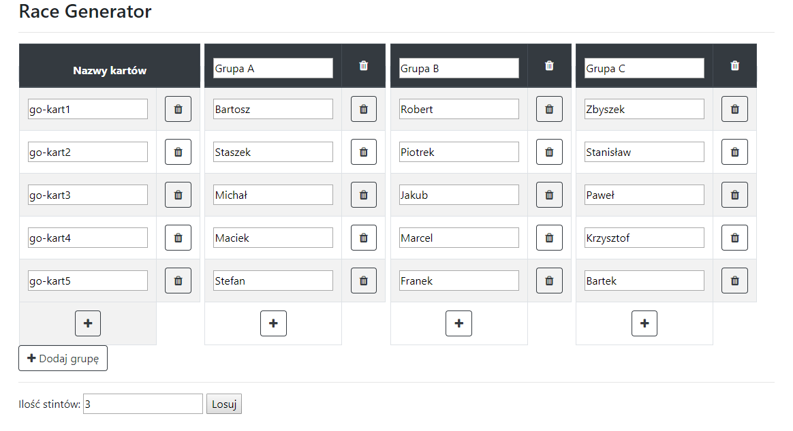

# Race Generator
> Application that allows you to generate random race configuration by drawing go-karts for drivers fairly. It was written for karting track in Świdnica.

## Table of contents
* [General info](#general-info)
* [Screenshots](#screenshots)
* [Technologies](#technologies)
* [Setup](#setup)
* [Status](#status)

## General info
Go-karts are not really balanced nowadays and I want to provide solution for that particular problem to avoid conflicts between drivers. Imagine situation when you are driver and you are taking part in race. At the beginning all drivers have to pick random go-kart somehow to start racing. It is not hard problem when there is only one stint(round), but most of the time it is not. We do not want to let participant drive the same go-kart twice, only in some cases(when number of stints is greater than number of go-karts). There are 3 variables in general: number of stints, number of groups and number of drivers. When they are all equal or almost equal we have 
high probability that driver will pick go-kart that he already drove or even a situation when there are literally no go-karts left for him, because drivers in his group already picked ones that he did not drove yet. It is really becoming an issue, because now all drivers in this group have to start picking again and some of them that picked powerful go-kart may not be happy about that.

## Screenshots

## Technologies
* Java - version 1.8
* Spring - version 5.1.9.RELEASE
* Thymeleaf - version 3.0.11.RELEASE
* HTML - version 5
* CSS - version 3
* Bootstrap - version 4.3.1
* JQuery - version 3.4.1
* Maven - version 4.0.0

## Setup
1. Download RaceGenerator.jar
2. Run it
3. Go to your browser and type: http://localhost:8080

## Status
Project is finished.

